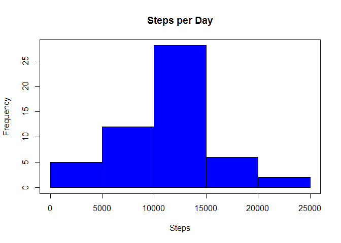
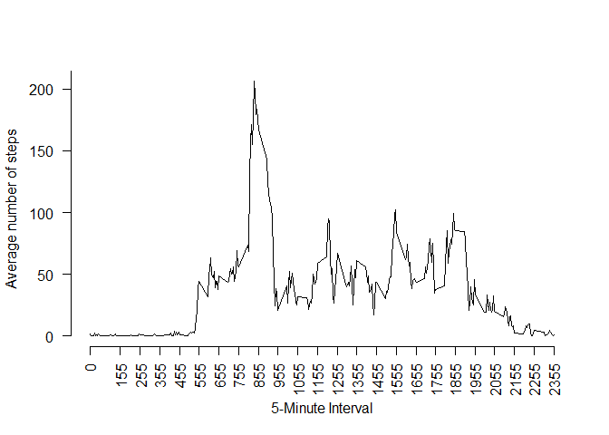
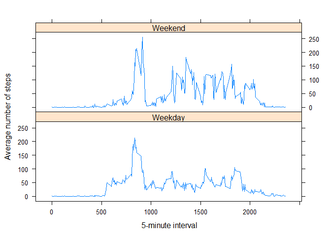

# Reproducible Research -> Peer Assessment
Student of Reproducible Research Coursera Course  
Wednesday, May 13, 2015  
Revised again 13/06/2015

## Loading and preprocessing the data (Used Windows 7 as OS)
1.  Getting the data from the web location indicated

```r
# setInternet2 to TRUE so download.file can works in knitr with https
setInternet2(use = TRUE) 
# Took data  from the original source as some issue with length is
# presented when the download is made in R from github location. If you
# have some trouble with the download, please unzip activity.zip in the
## dir you put .Rmd file  and comment next four lines & the unlink(temp)
fileUrl <- "https://d396qusza40orc.cloudfront.net/repdata%2Fdata%2Factivity.zip"
temp <- tempfile()
download.file(fileUrl,temp)
unzip(temp,"activity.csv", list = FALSE, overwrite = TRUE)
dataToUse <- read.csv("activity.csv", header=TRUE, 
                      colClasses = c("numeric","Date","integer"))
unlink(temp)
```
2.  Removing nulls and converting to use as a Data table 

```r
suppressWarnings(library(data.table))
```

```
## 
## Attaching package: 'data.table'
## 
## The following object is masked _by_ '.GlobalEnv':
## 
##     .N
```

```r
dataToUse <- data.table(dataToUse)
dataToUseNoNulls <- data.table(dataToUse[!is.na(dataToUse$steps),])
```
## What is mean total number of steps taken per day?
1.  Calculate the total number of steps taken per day

```r
stepsPerDay <- dataToUseNoNulls[,sum(steps, na.rm=T), by=date]
setnames(stepsPerDay, c("date","steps"))
```
2.  Histogram of the total number of steps taken each day

```r
hist(as.numeric(stepsPerDay$steps), c="blue", xlab="Steps", main="Steps per Day")
box()
```

 

3.  Calculating and reporting the mean and median of the total number of steps taken per day

```r
mean(stepsPerDay$steps, na.rm = TRUE)
```

```
## [1] 10766.19
```

```r
median(stepsPerDay$steps, na.rm = TRUE)        
```

```
## [1] 10765
```
## What is the average daily activity pattern?

1.  Series plot (i.e. type = "l") of the 5-minute interval (x-axis) and the average number of steps taken, averaged across all days (y-axis)

```r
stepsMeanPerInterval <- dataToUseNoNulls[,mean(steps, na.rm=T), by=interval]
setnames(stepsMeanPerInterval, c("interval","steps"))
plot(stepsMeanPerInterval$interval, stepsMeanPerInterval$steps
    , type = "l", axes = F,  ylab = "Average number of steps", xlab = "5-Minute Interval")
axis(side = 1,srt = 45, at = c(0,seq(155,stepsMeanPerInterval$interval[nrow(stepsMeanPerInterval)], by = 100)), las= 3)
axis(side = 2, at = seq(0, 250, by = 50), las=2)
```

 

2.  Which 5-minute interval, on average across all the days in the dataset, contains the maximum number of steps?

```r
## Maximum number of steps
maxNumOfSteps <- max(stepsMeanPerInterval$steps)
maxNumOfSteps
```

```
## [1] 206.1698
```

```r
##  5-minute interval which contains maximun steps
stepsMeanPerInterval[stepsMeanPerInterval$steps == maxNumOfSteps, interval]
```

```
## [1] 835
```

## Imputing missing values
1.  Calculating and reporting the total number of missing values in the dataset (i.e. the total number of rows with NAs)

```r
sum(is.na(dataToUse$steps))
```

```
## [1] 2304
```

2.  Filling in all of the missing values in the dataset using mean and creating a vector with the filledSteps. 

```r
filledSteps <- dataToUse$steps
for (n in 1:nrow(dataToUse)) {
    if (is.na(dataToUse$steps[n])) {
         intervalIndex = stepsMeanPerInterval$interval == dataToUse$interval[n]
         filledSteps[n] = stepsMeanPerInterval$steps[intervalIndex]
    }
}
```

3.  Creating a new dataset that is equal to the original dataset but with the missing data filled in steps column

```r
dataToUseFilled <- dataToUse
dataToUseFilled$steps <- filledSteps
```
4.  Making a histogram of the total number of steps taken each day and Calculating and reporting the mean and median total number of steps taken per day. 

```r
## Steps per Day from the filled data
filledStepsPerDay <- dataToUseFilled[,sum(steps, na.rm=T), by=date]
setnames(filledStepsPerDay, c("date","steps"))

## Histogram of the total number of steps taken each day
hist(filledStepsPerDay$steps, col="blue",xlab="Steps", 
     main="Steps per Day")
box()
```

 

```r
##Calculating and reporting the mean and median total number of steps taken per day
mean(filledStepsPerDay$steps)
```

```
## [1] 10766.19
```

```r
median(filledStepsPerDay$steps)
```

```
## [1] 10766.19
```
* Do these values differ from the estimates from the first part of the assignment? 
        The mean is the same as it was used as replace the missing values. The median changed a little from 17165 to 17166.19

* What is the impact of imputing missing data on the estimates of the total daily number of steps?
        There is no impact of imputing missing data on the estimates of the total daily number of steps.

## Are there differences in activity patterns between weekdays and weekends?
1.  Creating a new factor variable in the dataset with two levels - "weekday" and "weekend" indicating whether a given date is a weekday or weekend day.

```r
## Define data day as a weekday or a weekend
## Saturday in day format has value 6 and Sunday has value 7
dataToUseFilled$typeOfDay <- ifelse (format(as.Date(dataToUseFilled$date,
                                                   "%Y-%m-%d"),"%w") 
                                     %in%  c(6,7), "Weekend" , "Weekday")

dataToUseFilled$typeOfDay <- as.factor(dataToUseFilled$typeOfDay)
```

2.  Making a panel plot containing a time series plot (i.e. type = "l") of the 5-minute interval (x-axis) and the average number of steps taken, averaged across all weekday days or weekend days (y-axis). 

```r
stepsMeanPerIntervalPerWeek <- dataToUseFilled[,mean(steps, na.rm=T), 
                                                by=list(typeOfDay,interval)]
setnames(stepsMeanPerIntervalPerWeek, c("typeOfDay","interval","steps"))

library(lattice)
xyplot(stepsMeanPerIntervalPerWeek$steps ~ stepsMeanPerIntervalPerWeek$interval
      | stepsMeanPerIntervalPerWeek$typeOfDay, type = "l", layout = c(1,2),  
      xlab = " 5-minute interval", ylab = "Average number of steps")
```

 
